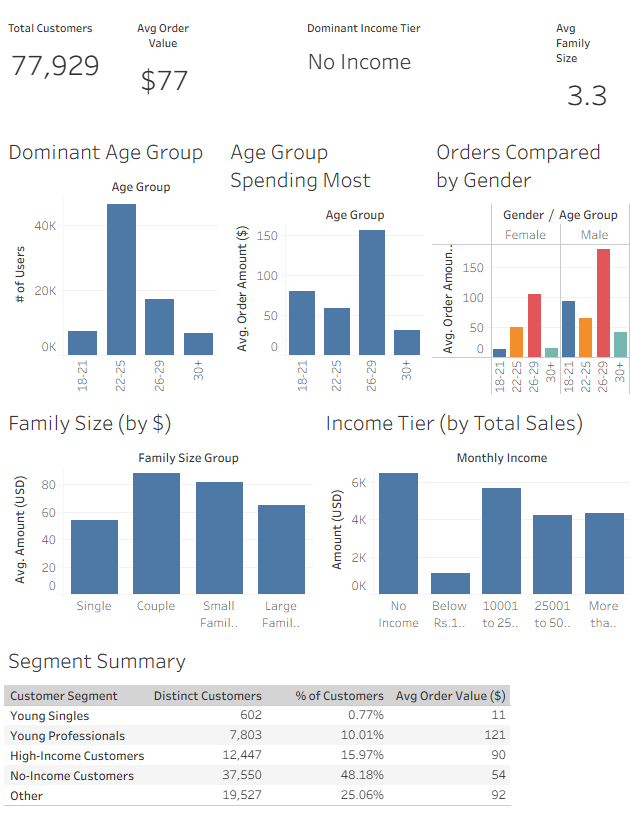

# Customer Segmentation & Purchase Behavior Analysis (SQL)

## Project Overview

This project analyzes customer purchasing behavior to identify how demographic characteristics—including income, age, family size, and gender—influence order value and purchasing patterns. Using SQL for data analysis and Tableau for visualization, the project explores key drivers of customer spending and highlights actionable business insights that can support customer segmentation, marketing strategy, and business decision-making.

---

## Business Questions

1. Do higher-income customers tend to place higher-value orders?
2. How does order value vary by customer age, family size, and gender?
3. Which customer segments drive sales volume versus transaction value?
4. What customer characteristics best explain spending behavior?

---

## Tools & Technologies

* SQL (SQLite)
* Tableau
* Excel / CSV

---

## SQL Skills Demonstrated

* INNER JOINs across relational datasets
* Aggregations and KPI reporting
* Customer segmentation using CASE statements
* Common Table Expressions (CTEs)
* Window Functions (RANK)
* Revenue and customer behavior analysis
* Business-focused insight generation

---

## Dataset Structure

### users.csv

Contains customer demographic information:

* user_id
* name
* age
* gender
* income
* family_size

### orders.csv

Contains customer transaction information:

* order_id
* user_id
* order_date
* sales_amount

The datasets are linked through user_id, allowing customer demographic attributes to be analyzed alongside purchasing behavior.

---

## Key Findings

### Spending Behavior

* Customer spending was influenced more by life stage than income alone.
* Customers aged 26–29 recorded the highest average order values.
* Customers aged 22–25 generated the highest transaction volume.

### Family Structure

* Couples placed the highest-value orders among all family-size segments.
* Larger household sizes did not necessarily correspond with higher spending.

### Gender Analysis

* Male customers exhibited higher average order values across all age groups.

### Customer Mix

* Customers reporting no income generated the largest share of sales volume due to customer count rather than individual spending levels.

---

## Key Metrics

| Metric              | Value |
| ------------------- | ----- |
| Average Order Value | $77   |
| Average Family Size | 3     |
| Orders per Customer | 1     |

---

## Dashboard

[View Interactive Tableau Dashboard](https://public.tableau.com/views/FinalProject-MatthewSchneider/Dashboard1?:language=en-US&publish=yes&:sid=&:redirect=auth&:display_count=n&:origin=viz_share_link)

### Dashboard Preview

---

## Business Recommendations

* Develop targeted marketing campaigns for customers aged 26–29, who demonstrate the highest average spending behavior.
* Create retention and loyalty initiatives focused on high-value customer segments.
* Evaluate demographic characteristics beyond income when designing customer acquisition strategies.
* Further investigate spending behavior using longitudinal data to better understand customer lifetime value.

---

## Limitations

* Each customer has only one recorded transaction.
* Analysis reflects single-purchase behavior rather than long-term customer value.
* Findings should be validated using repeat-purchase and longitudinal customer data.

---

## Repository Contents

* customer_analysis.sql — SQL analysis queries
* README.md — Project documentation
* users.csv — Customer dataset
* orders.csv — Order dataset
* dashboard_screenshot.png — Tableau dashboard preview

---

## Author

Matthew Schneider

Data Analytics Portfolio Project

